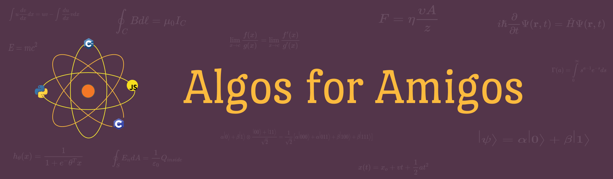

## All the Algorithms you'll ever need xD

This repository contains all the algorithms we have encountered in the fields of Computer Science, Mathematics and Physics!

<h1 align="center"><a href="https://organize.mlh.io/participants/events/4390-kickstarting-hacktoberfest-with-acm-vit">Kicking Off Hacktoberfest with ACM-VIT!</a></h1>

<h2 align="center">  </h2>

 
Where Computer Science Theory meets Practice!

  
    
     
    

---
## Overview

This year we've introduced a whole range of new topics that can be taken up by newbies and seasoned professionals
alike! There is something for everyone to work on, as we have issues in Web Development, Machine Learning, 
Advanced Algorithms, Database Management Systems, Automata Theory, Graph Theory, Deep Learning, Linear Algebra and even Assembly Level Programming.

### Choosing an Issue

You don't need to be an expert in any of these topics to start. Just pick one that suits you and
start coding!

---

## Submitting a Pull Request

* Fork the repository by clicking the fork button on top right corner of the page
* Clone the target repository. To clone, click on the clone button and copy the https address. Then run 
 <pre><code>git clone [HTTPS-ADDRESS]</code></pre>
* Go to the cloned directory by running 
<pre><code>cd [NAME-OF-REPO]</code></pre>
* Create a new branch. Use 
<pre><code> git checkout -b [YOUR-BRANCH-NAME]</code></pre>
* Make your changes to the code. Add changes to your branch by using 
<pre><code>git add .</code></pre>
* Commit the chanes by executing
<pre><code>git commit -m "your msg"</code></pre>
* Push to remote. To do this, run 
<pre><code>git push origin [YOUR-BRANCH-NAME]</code></pre>
* Create a pull request. Go to the target repository and click on the "Compare & pull request" button. **Make sure your PR description mentions which issues you're solving.**
</img>
* Wait for your request to be accepted. 

---
## Guidelines for Pull Request

<!-- general guidelines here -->
  * Avoid pull requests that :
      * are automated or scripted
      * that are plagarized from someone else's branch
  * Do not spam
  * Project maintainer's decision on validity of PR is final.

  For additional guidelines, refer to [participation rules](https://hacktoberfest.digitalocean.com/)

---

## What counts as a PR?
Check out our [issues](https://github.com/ACM-VIT/Algos-for-all-Amigos/issues) and try to solve them !

---
## Interacting with Issues

  * There are helper issues that detail all you have to do to complete the project.
      * Read the helper issues and work on the corresponding code in your fork of the repo.
      * If you have some doubt regarding the 'help' given, comment below the issue.
      * If you have some doubt not related to any 'helper issue/s' open, Open up a new issue, select doubt and fill in the template.
  * If you want to provide some extra help to fellow participants, open up a new helper issue. Don't include any solution/code!
  * Do not spam

---

  

## Current Topics!

#### Computer Science

📂1_DSA_Fundamentals 
  ┣ 📂1_Sorting_Algorithms 
  ┣ 📂2_Stacks_Queues_Linked_Lists 
  ┗ 📂3_Graphs 

📂2_Competitive_Programming 
 
📂3_Programming_Languages 
  ┣ 📂C 
  ┗ 📂Python 

📂4_Object_Oriented_Programming 

📂5_Interview_Questions 
   
📂6_Machine_Learning 
   ┗ 📂Classification 

📂7_Assembly_Level_Programming 

 

#### Mathematics

📂Linear Algebra 

📂Series 

 
